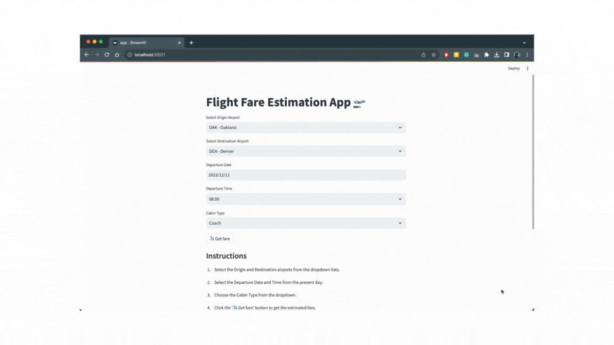

# Flight Estimator Streamlit App

This is a Streamlit application for machine learning models that will estimate the flight fares between two US cities. It allows you to interact with pre-trained models and see their results. The web application must be containerised with Docker and run using Python 3.9.13.

## File Structure

- `models/`: This directory contains pre-trained machine learning models.
    - `keras_neural_network.joblib`: A joblib file containing a Keras Neural Network model.
    - `multilayer_neural_network.joblib`: A joblib file containing a Multilayer Neural Network model.
    - `random_forest.joblib`: A joblib file containing a Random Forest model.
    - `xgboost.joblib`: A joblib file containing an XGBoost model.
- `app.py`: The main Streamlit application script.
- `docker-compose.yml`: A Docker Compose file for running the Streamlit app in a container.
- `Dockerfile`: The Dockerfile for building the Streamlit app container.
- `requirements.txt`: A list of Python packages required for the application.

## Getting Started

1. **Clone the Repository**

    ```shell
    git clone https://github.com/ssandeed/flight_estimator_app.git
    ```

    ```shell
    cd flight_estimator_app
    ```

2. **Build the Docker Image**

    ```shell
    docker build -t my-streamlit-app .
    ```

3. **Run the Docker Container**

    ```shell
    docker run -p 8501:8501 my-streamlit-app
    ```

4. **Access the App**

    Open a web browser and go to [http://localhost:8501](http://localhost:8501) to access the Streamlit app.



## Usage

- Upon opening the Streamlit app, you can interact with the machine-learning application and see the fare estimation.

## Dependencies

All the required Python packages are listed in `requirements.txt`. They will be automatically installed when building the Docker image.

## Support and Issues

If you encounter any issues or have questions, please open an issue on the [GitHub repository](https://github.com/ssandeed/flight_estimator_app/issues).

Enjoy using the Streamlit app!

